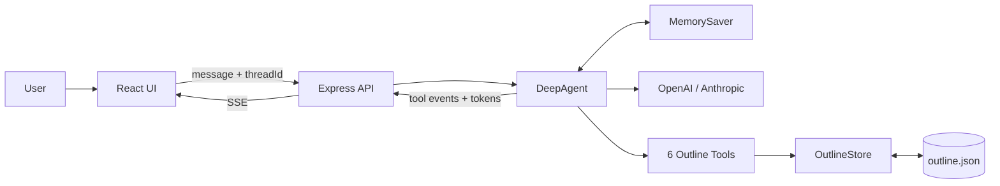
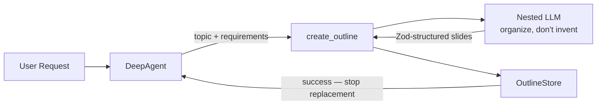

# Document Outline Agent — Design

## Architecture

The app separates natural-language reasoning from deterministic outline mutations.

**Flow:** The UI sends a natural-language instruction to DeepAgent. The agent inspects the outline, resolves the user's references, and chooses one or more tools. Zod validates tool arguments; OutlineStore validates state-dependent rules and persists changes to `outline.json`. Tool activity and response tokens stream back to the UI.

There are two kinds of state:

- `outline.json` — source of truth for the document.
- `MemorySaver` — conversation context for follow-ups and clarification.

Conversation history helps understand intent, but IDs and positions for mutations come from the current outline.

## Key Design Decisions

### 1. Put determinism at the right boundary

| Layer | Responsibility |
| --- | --- |
| DeepAgent | Understand language, resolve references, clarify ambiguity, sequence tools |
| System prompt | Cross-tool behavioral rules |
| Tool descriptions | Operation-specific semantics |
| Zod | Validate tool-call shape |
| OutlineStore | IDs, bounds, invariants, persistence |

The model handles semantics; deterministic code handles rules the application can guarantee.

### 2. Tool definitions are the agent API

The model chooses actions from tool names, descriptions, and schemas, so these are treated as an API for the model.

A test exposed an important distinction:

- `add_item.position` = insertion position. After item N means N + 1.
- `move_item.position` = final position after the move.

This logic belongs in each tool's description rather than the global prompt.

### 3. Nested LLM design for `create_outline`

`create_outline` has a second LLM boundary: DeepAgent decides **when** a new outline is needed, while the nested model converts the supplied content into slides.

**Observed:** The initial version passed only a broad topic to the nested model. User constraints could be lost, unsupported details could be generated, and the outer agent could repeat `create_outline`.

**Changes:** The outer agent now passes `topic` plus preserved `requirements` and treats one successful call as completing the replacement. The nested model is constrained to organize and rephrase supplied information, while `withStructuredOutput` enforces the expected slide structure.

**Boundary:** DeepAgent owns **intent and orchestration**; the nested model owns **content organization**; Zod owns **output structure**.

### 4. Always use fresh state before editing

**Observed:** The agent updated Next Steps using an ID remembered from conversation history without first listing the outline.

**Decision:** Before `add_item`, `update_item`, `move_item`, or `delete_item`, call `list_outline` once in the same turn. Memory is for conversation continuity, not current document state.

### 5. Clarify ambiguous references

**Observed:** With multiple pricing-related slides, "delete the pricing slide" could select the recently discussed slide.

**Decision:** Resolve references against the current outline. If multiple items plausibly match, ask the user instead of using conversation recency as a tie-breaker.

History may still resolve explicitly contextual references such as "the one I just added".

### 6. Keep compound requests atomic when ambiguous

For a request such as:

> Move Competitive Analysis to the top and delete the pricing slide.

if the move is clear but "pricing slide" is ambiguous, no mutation is performed yet. The agent preserves the understood intent, asks one clarification question, then completes the request.

This avoids partially applying a request before the full intent is known.

### 7. Do not invent missing user intent

**Placement:** A new slide needs a resolvable title and placement. Relative instructions such as "before Next Steps" or "at the end" are converted to positions from the current outline. If placement is absent, ask rather than silently append.

**Description:** Testing showed the model could invent a description even when the user supplied none. Zod cannot determine whether text was user-provided, so the prompt/tool contract explicitly says not to generate or infer one.

**Current gap:** `add_item.position` is still optional in the uploaded implementation and the store still defaults it to the end. The final design is to make placement required at the tool boundary.

### 8. No factory or class hierarchy for chat models

**Considered:** A base chat-model class, with OpenAI and Anthropic subclasses selected by a factory, so a later provider such as Gemini would be another subclass.

**Decision:** Do not do it. For this scope each class would only check an API key and instantiate the library client. That is already what `loadModel` does from `MODEL_PROVIDER`. The agent and tools only need the resulting client. A provider class earns a place when it has behavior of its own, not when it only wraps construction.

### 9. General prompt over test-case overfitting

**Observed:** Writing the test sentences into the prompt made those cases pass, and it also tied the agent to that list.

**Decision:** Those sentences were removed. The prompt states the rule. How a tool uses a position stays in that tool's description.

| Removed example | General rule |
| --- | --- |
| "Intro" means Introduction | A short or partial title counts only when it matches one current slide |
| "Delete the pricing slide" when two pricing slides exist | Several plausible matches means ask. Do not use recency to choose |
| There is no appendix | No match means explain and do not invent a slide |
| "Next Steps" after it was renamed to Closing | Use `list_outline` for current titles. History explains intent, not the latest outline |

### 10. Prefer explicit tool names over tool categories

**Observed:** "Before mutations, call `list_outline`" was less reliable because the model first had to infer which tools counted as mutations.

**Decision:** When a rule applies to specific tools, name them directly instead of asking the model to classify them into an abstract category. The prompt therefore requires `list_outline` before `add_item`, `update_item`, `move_item`, or `delete_item`. `create_outline` is intentionally excluded because it replaces the outline rather than operating on existing items.

## Failure Handling

Failures are handled where they can be detected reliably:

- **Zod:** invalid tool argument shape and basic constraints.
- **OutlineStore:** missing IDs, invalid positions, empty updates, persistence.
- **Agent:** ambiguous or unresolved natural-language references.
- **Tool wrapper:** model and file failures are returned safely instead of crashing the turn.

The store also serializes file operations to avoid overlapping mutations of `outline.json`.

## Alternatives Considered

**Model confidence scores** — rejected because model-generated confidence is not a reliable correctness boundary.

**Deterministic reference resolver** — useful for exact matches but weak for semantic references such as "the slide where we compare ourselves with competitors".

**Intent classifier / custom planner** — rejected for now because one request can require several ordered operations, and DeepAgent already provides multi-tool orchestration. A structured operation plan would be considered only if further testing shows the current approach is insufficient.

## What I'd Do With More Time

- Align `add_item.position` schema and store behavior with the final placement rule.
- Return structured tool error codes for more predictable recovery.
- Show tool inputs and outcomes in the chat. The stream already reports each tool as it is called, and the reply text arrives as tokens. The page does not show the arguments, or whether the call succeeded or failed, so a finished tool only reads as `Done: move_item`. Sending those details to the UI would let the user see what the agent attempted and how it turned out. Tokens from the inner `create_outline` model call stay hidden so raw JSON does not appear in the chat.
- Add agent regression/evaluation cases for ambiguous and multi-step instructions.
- For a real multi-instance deployment, replace in-memory checkpoints and JSON persistence with durable shared storage.

## Design Principle

Use the model where semantic understanding is necessary; use tool contracts to shape its behavior; use deterministic code for invariants the application can guarantee.

The design was refined through repeated test → observe failure → identify owning layer → change → retest cycles rather than special-casing the provided walkthrough prompts.
